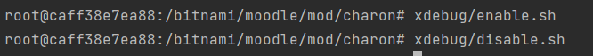
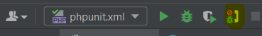
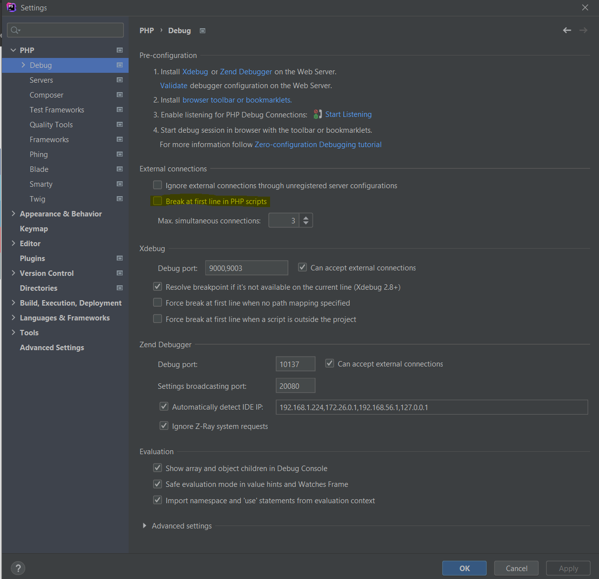
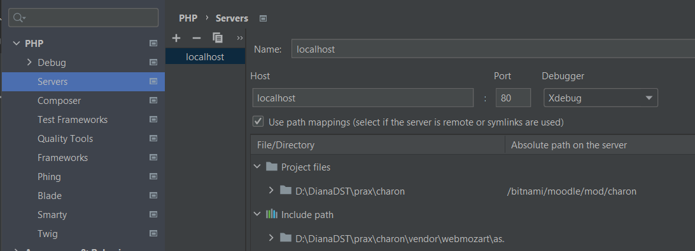

## Xdebug kasutamine

### Konteineris

Silumise alustamiseks käivitage charoni kataloogis `xdebug/enable.sh`
Kuna Apache restarditakse, suleb see mõnikord konteineri :( Praegu pole head lahendust, kuidas seda vältida. Lihtsalt käivitage charon-moodle konteiner uuesti. Sama võib juhtuda ka silumise lõpetamisel.

Silumise sisselülitamine teeb php täitmise konteineris veelgi tuntavalt aeglasemaks. Kasutage ainult siis, kui tarvis. `xdebug/disable.sh` lülitab selle uuesti välja.

### PhpStormis

Vaikimisi seaded peaksid olema alustamiseks ok.
Konteineri silumise jälgimiseks piisab `Run -> Start listening for PHP debug connections`.

Esimesel silumissessioonil (õigemini esimesel Xdebug ühenduse tekkimisel) konfigureerib PhpStorm vastavuse lokaalsete ning konteineri php lähtefailide vahel. Kui kõik toimib, peaks kasutaja ainult valima silutava projektifaili. See peaks olema `index.php` teie charoni lokaalses põhikataloogis. `File path on server` peaks olema juba seatud väärtusega `/bitnami/moodle/mod/charon/index.php`.

Vaikimisi seadetes on sisse lülitatud igakordne peatumine php skriptide alguses. Selle kohta on seadetes `PHP->Debug`  mitu sätet. Esimeseks testiks, et kas silumine põhimõtteliselt töötab, on see ok. Reaalseks tööks lülitage need välja.

Silumiseks kasutage Charonit nagu tavaliselt, läbi oma veebilehitseja. Seadke vajalikud breakpointid ja jätkake silumist, kui täitmine nendeni jõuab.

### Võimalikud probleemid

Kui silumine ei tööta, tuleb kõigepealt aru saada, kas probleem on konteineris või PhpStormi poolel.
Vaadake konteineris faili `/tmp/xdebug.log`. Kui fail puudub, ei ole xdebug mingil põhjusel töös. Logifailist võib saada informatsiooni võimalike probleemide kohta.

Viga `Could not connect to client` võib tähendada, et hosti, kus PhpStorm töötab, ei leitud kätte. Proovige failis `99-xdebug.ini` asendada `xdebug.remote-host` väärtus `host.docker.internal` oma arvuti lokaalse ip aadressiga. Pärast seda käivitage uuesti `xdebug/enable.sh`.

Kui näete PhpStormi event logis teateid `Debug session was finished without being paused`, on ühendus konteineri ja PhpStormi vahel olemas. Kui sellest hoolimata täitmine ei peatunud breakpointis (ja olete kindel, et seda breakpointi oleks pidanud läbitama), kontrollige vastavust kliendi ja hosti lähtefailide vahel.

PhpStormi seadetes `PHP->Servers` peaks `Project files` jaotises olema vastavuses Charoni kataloogid lokaalses arvutis ja konteineris. `Absolute path on the server` peaks olema väärtusega `bitnami/moodle/mod/charon`.